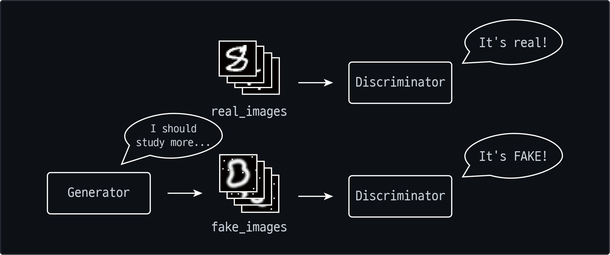
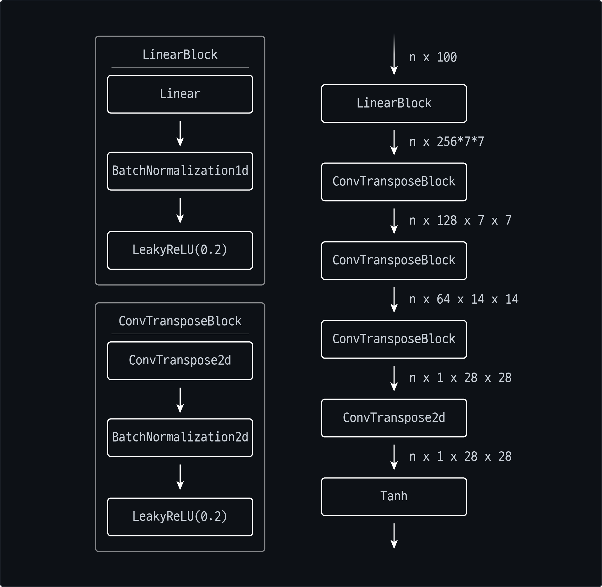

# MNIST GAN
> A project to build a Generative Adversarial Network with Convolutional Neural Network with the MNIST hand-written digits dataset.

## Task
 The objective of this project is to demonstrate the overall structure of Generative Adversarial Networks(GANs). 
 In this project, I applied CNN to both generator and discriminator to reduce the number of parameters and better feature extraction.

## Method
### GANs
GAN is a concept of unsupervised generative neural network which's strategy is to have a separate discriminator that discriminates whether the input is real or fake: the one that generator made. 
The picture below is simplified illustration of GANs strategy.

As far as GANs have two separate models which called the generator and the discriminator, the two models also should be trained separately.
#### Train Discriminator
First, you have to train the discriminator. As you know, the discriminator tells us the input is a real one or a fake one. This is a binary classification problem. I trained the discriminator to return 1 if the input is real, 0 if the input is fake. I used binary cross entropy as a loss function (`BCELoss`).

#### Train Generator
Then you have to train the generator. Training the generator is easier than training the discriminator. You can simply generate some fake images, tell the discriminator this image is the real one and update weights with that loss. Then, the generator will reinforce its current behavior.

### Binary Cross Entropy Loss
In binary classification problem, binary cross entropy loss (`BCELoss`) is commonly used as a loss function. While the discrimination is binary classification problem, `BCELoss` is a good loss function for the discriminator. The `BCELoss` receives two matrices with same shapes, returns the reconstruction error between the input and the target.

### Xavier Normal Initialization
Weight initialization is very important factor to achieve good result on deep learning. `Xavier initialization` is known as a good initialization for sigmoid activation. But in this project, even we used `LeakyReLU` activation function, `Xavier Normal Initialization` performed better than `He Normal Initialization` which known better on `ReLU` kind of activated deep learning model. Below is an equation to get weight where `fan_in` and `fan_out` stands for the number of node in the next layer and the previous layer.

### Implementation
All codes for this project is written in `Python` programming language and depends on `PyTorch` pachage.

#### Generator
The generator consists of one linear block, four convolution transpose blocks and `Tanh` activation at last. The linear block consists of `Linear` layer, `BatchNorm1d` layer and `LeakyReLU` activation layer and the convolution transpose block consists of `ConvTranspose2d` layer, `BatchNorm2d` layer and `LeakyReLU` activation layer. This model receives `n x 100` input and returns `n x 1 x 28 x 28` single-channel images.

#### Discriminator
The discriminator consists of three convolution block, `linear` layer and `Sigmoid` activation layer. The convolution block consists of `Conv2d` layer, `BatchNorm2d` layer and `LeakyReLU` activation layer.

## Experiment
### Training
The model was trained for `20` epochs and optimized with `Adam` optimizer (learning rate of `1.0E-4`, other parameters are set to default).

### Result
Images below are the output at epochs `1`, `11` and `20` (the last).

It seems it's getting more like hand-written digits. And the chart below is the loss function across all 20 epochs training.

The discriminator loss of real images and fake images are simillar and as the discriminator loss decrease, the generator loss is synchronously increasing.

And here's the result of the model across the first epoch to the last epoch.

## Dependency

